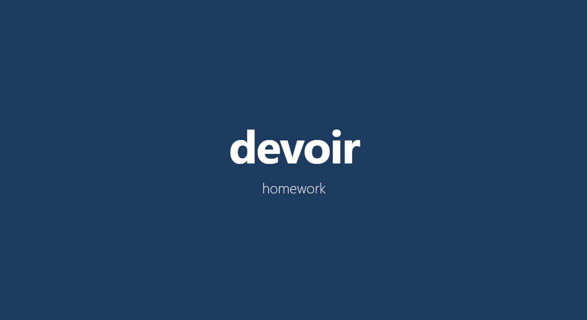

<div align="center">

# language-app

<p align="center">
  
</p>

Fullscreen flash cards: a French word up top, English translation below, on a solid color background that shifts every few seconds. Each round picks a random pair from your JSON word list.

</div>

<details>
<summary>Setup & details</summary>

## Why?

I'm learning French and have a second monitor that sits idle most of the day. This runs fullscreen there—random word pairs on a rotating background—so vocabulary sticks without me opening another app or clicking through anything.

**Live:** https://antonio-in-stem.github.io/language-app/

## Run locally

```bash
npm install
npm run dev
```

Open the URL Vite prints (usually http://localhost:5173). Do not open `index.html` directly. The app needs the dev server to compile TypeScript and React.

## Word list

Edit `public/words.json`. Each entry needs `french` and `english` strings.

```json
{ "french": "Bonjour", "english": "Hello" }
```

## Build

```bash
npm run build
npm run preview
```

Pushes to `main` deploy to GitHub Pages via `.github/workflows/deploy.yml`.

</details>

<div align="center">

## Stack

React, TypeScript, Vite, and Tailwind CSS.

<p align="center">
  <a href="https://skillicons.dev">
    
  </a>
</p>

</div>